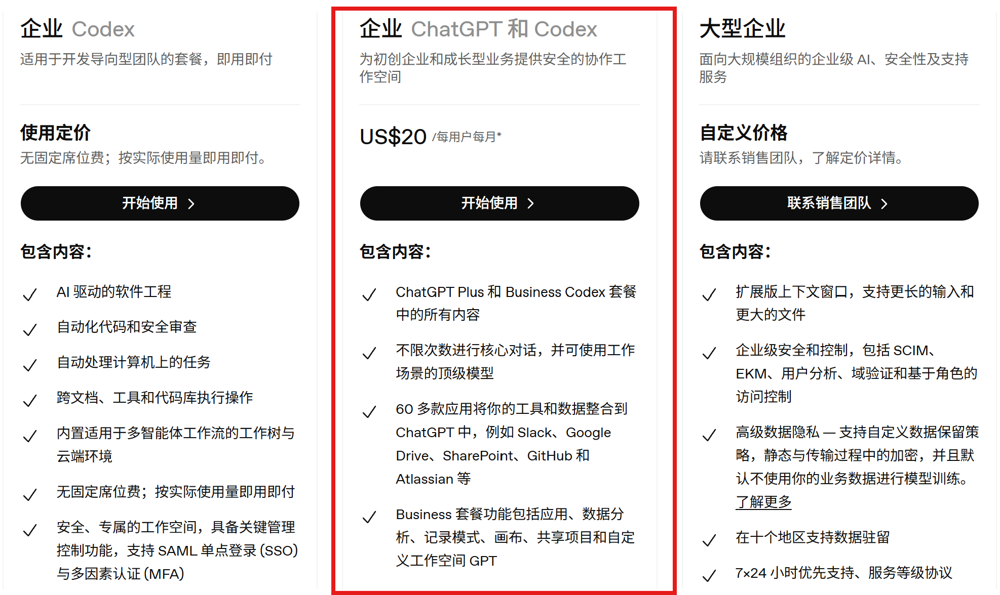
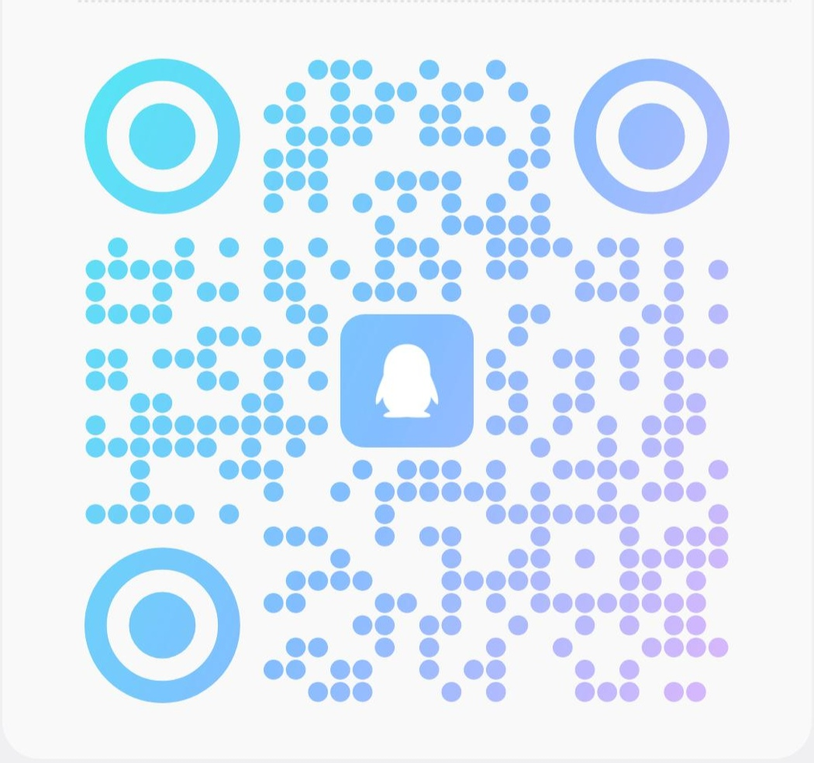

# ChatGPT team/business 会员介绍和使用教程

## 商品介绍
[官网套餐介绍 chatgpt.com/zh-Hans-CN/pricing](https://chatgpt.com/zh-Hans-CN/pricing/)

本店售卖的ChatGPT team/business会员, 即为下图中的"企业 ChatGPT和Codex", 包含gpt plus和codex

* 充到你的gpt账号(邮箱)上, 下单后邮箱兑换
* 本店已**稳定运行几个月**, 有售后, 质保一个月, 放心下单  
* 可长期续费, 续费后数据可保留在原空间

使用额度:
* Thinking: 周3000次
* pro: 月15次
* codex: 类似plus

## 使用说明
下单完成后会发卡密, 兑换到自己的邮箱.

1. 账号安全性评估: 
    * 自己注册的(推荐gmail), 至少稳定使用过一个月
    * 若没有, 可在第三方店铺(如 https://shop.gpt.ge/ )购买六元成品号
2. 会收到确认邮件, 不用从邮箱点进去, 邮件只显示codex代码邀请是正常的, 重登后网站和codex都可以用. 
3. **退出重登**: 收到邮件后, 在gpt网页端退出登录, 再重登进去, 若显示未分配gpt使用权限, 没关系, 重新操作: 
    * 退出登录
    * 删除浏览器cookie(怎么删见下文补充部分)
    * 更换节点(比如日/新/美)后, 再次登录
    * 网站登录成功后, 再打开codex, 也是先退出再重登
4. 若出现额度用完的提示, 同上, 退出重登即可
5. 若还是不行, 也不要频繁尝试, 请稍后再试, 或联系管理员
6. 如果出现 Codex 弹窗验证手机号, 请先退出账号并重新登录几次, 看是否可以正常通过. 若仍无法通过, 请按官方提示使用本人可接收验证码的号码完成验证, 或更换合规可验证的账号(如绑定自己手机号的gmail邮箱), 或使用一些第三方接码平台(https://www.smspool.net/)。

## 补充
1. 售后qq群: 914585964  

2. 近期官方风控较严格, 尽量保证账号使用环境干净, 网络环境稳定, 一般就用同一个节点, 不要频繁更换
3. 正常使用一般很稳, 若因为我们的原因掉车了会补; 
4. 怎么删cookie: 网址前有个锁(edge)/两横(chorme)的图标, 点击后选择cookie-正在使用的cookie, 逐个点击删除全部cookie即可
